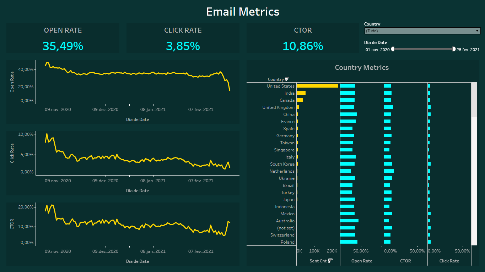

# 📧 Email Marketing Dashboard

## 🔗 [Acesse o Dashboard Interativo no Tableau Public](https://public.tableau.com/views/EmailMetricsDashboard_17700433887740/EmailMetrics?:language=pt-BR&publish=yes&:sid=&:redirect=auth&:display_count=n&:origin=viz_share_link)

## 🎯 Sobre o Projeto
Este painel foi desenvolvido para monitorar a eficácia de campanhas de e-mail marketing de um e-commerce. O foco principal foi analisar o funil de engajamento do usuário, desde o envio até o clique.

## 📊 Principais KPIs Analisados
- **Open Rate (Taxa de Abertura):** Mede a eficácia do assunto do e-mail.
- **Click Rate (Taxa de Clique):** Mede o engajamento geral sobre o total de enviados.
- **CTOR (Click-To-Open Rate):** A métrica mais crítica para avaliar o conteúdo/design do e-mail (quem abriu, clicou?).

## 🛠️ Tecnologias e Técnicas
- **SQL (BigQuery):** Uso de `UNION ALL` para combinar dados de tabelas de envio e tabelas de sessão, além de `DATE_ADD` para calcular datas relativas.
- **Tableau:**
    - Criação de Campos Calculados para taxas (%).
    - Design em **Dark Mode** para visualização de alto contraste.
    - Filtros interativos de contexto (País e Data).
