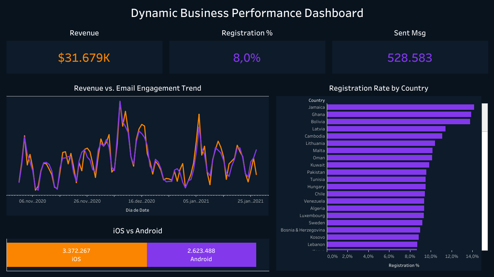

# 📊 Dynamic Business Performance Dashboard

## 🔗 [Acesse o Dashboard Interativo no Tableau Public](https://public.tableau.com/views/DynamicBusinessPerformanceDashboard/DynamicBusinessPerformanceDashboard?:language=pt-BR&publish=yes&:sid=&:redirect=auth&:display_count=n&:origin=viz_share_link)

## 🎯 Sobre o Projeto
Este painel integra três pilares críticos de um e-commerce: **Receita Financeira**, **Conversão de Registros** e **Engajamento de E-mail Marketing**. O diferencial deste projeto foi a criação de uma visão 100% dinâmica, permitindo correlacionar o impacto das campanhas de e-mail nos resultados financeiros por país e dispositivo.

## 📊 Principais Diferenciais e KPIs
- **Filtro Nativo de Interação:** O painel reage instantaneamente ao clique em qualquer país ou sistema operacional, recalculando todas as métricas em tempo real.
- **Métricas de Conversão:** Analisa o `Registration %` (Taxa de Registro) cruzando dados de sessões com criação de contas.
- **Análise Mobile:** Comparação direta de receita entre **iOS vs Android** utilizando barras empilhadas para visualização de market share.

## 🛠️ Tecnologias e Técnicas
- **SQL Avançado (BigQuery):** Uso estratégico de **Common Table Expressions (CTEs)** para organizar a lógica de negócio e `UNION ALL` para consolidar eventos de origens distintas.
- **Tableau:**
    - **Cálculos de Agregação:** Foco em métricas dinâmicas para evitar erros de escala em taxas percentuais.
    - **Eixo Duplo:** Visualização combinada de Tendência de Receita e Volume de E-mails.
    - **Visual Strategy:** Design em **Dark Mode** com paleta customizada: Laranja (`#FB8500`) para Financeiro e Roxo (`#8338EC`) para Engajamento.
